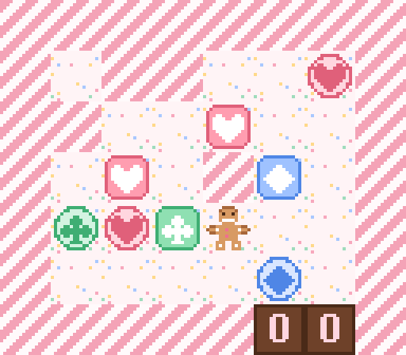

# Caramelos Pegajosos

El niño de jengibre tiene que llevar cada caramelo a su zona de color, pero los caramelos que se tocan se quedan pegados
para siempre y se mueven en bloque. Niveles propios, cada uno con su mínimo demostrado por búsqueda completa. Juego web
autónomo en **PuzzleScript Next**, con el estilo «Caramelo».

## Cómo se juega
- **Objetivo:** cada caramelo a una zona de su color (se ribetea de oro al llegar).
- **Se pegan:** los caramelos que se tocan quedan unidos para siempre (aunque sean de colores distintos) y se mueven juntos; si uno choca, no se mueve ninguno.
- **El chicle** (novedad de esta versión): se pega a todo, igual que un caramelo, pero no tiene zona. Puede ser una trampa… o la herramienta que une dos caramelos.
- **Flechas:** mover · **Z:** deshacer · **R:** reiniciar. En el móvil, desliza el dedo.
- **Ayudas** (arriba a la derecha): ojo, reiniciar, pista (el mejor movimiento desde donde estés), deshacer y solución animada.

## Niveles
1. Primer bocado: mínimo 18 pasos
2. Golosina: mínimo 29 pasos
3. Pegajoso: mínimo 62 pasos
4. Chicle traicionero: mínimo 56 pasos
5. Chicle en la esquina: mínimo 60 pasos
6. Puente de chicle: mínimo 76 pasos
7. Empacho: mínimo 78 pasos
8. Ración doble: mínimo 80 pasos
9. Atasco de golosinas: mínimo 89 pasos

## Créditos
- Niveles, arte 16-bit y tarjetas: **Spider** (Fali + Claude), 2026
- Mecánica: *Sticky Candy Puzzle Saga*, de **Alan Hazelden** (galería de PuzzleScript)
- Motor: [PuzzleScript Next](https://github.com/david-pfx/PuzzleScriptNext), incrustado en un único `index.html`
- Fuente del juego: [`juego.txt`](juego.txt)
